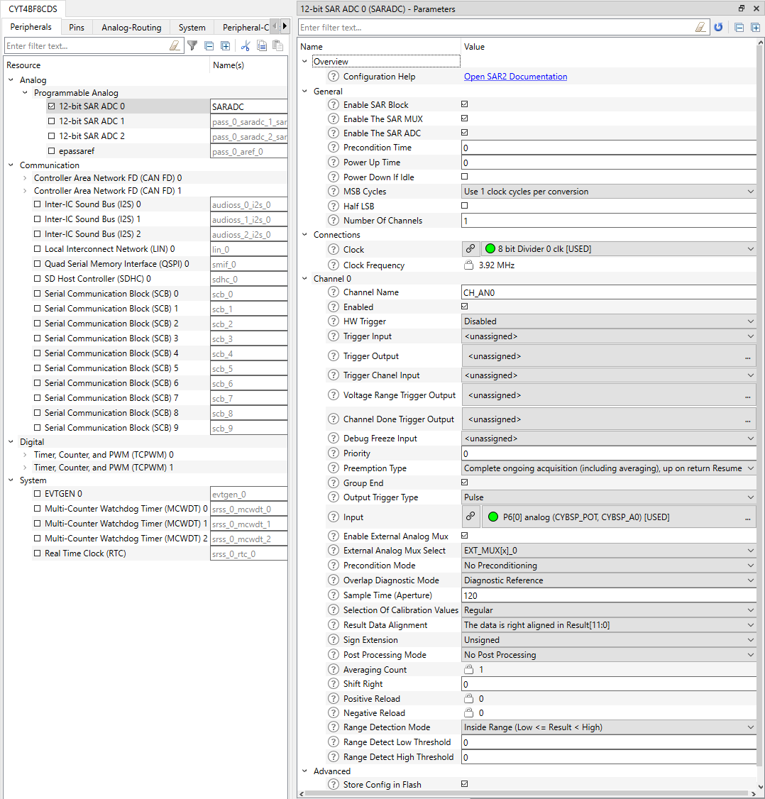
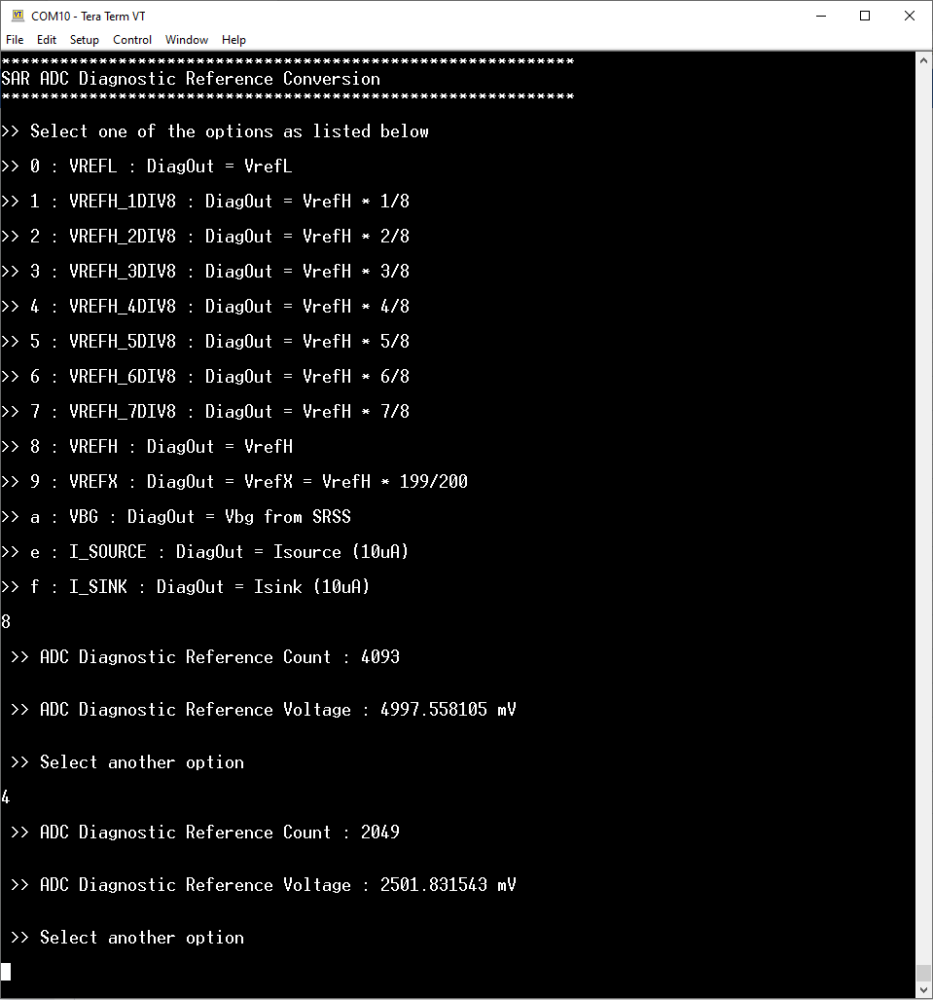

# ADC Diagnostic Reference Conversion
**This code example demonstrates the usage of the diagnostic reference for debugging the functionality of the on-chip ADC (Analog-to-Digital Converter) module.**  

## Device
The device used in this code example (CE) is:
- [TRAVEO™ T2G CYT4BF Series](https://www.infineon.com/cms/en/product/microcontroller/32-bit-traveo-t2g-arm-cortex-microcontroller/32-bit-traveo-t2g-arm-cortex-for-body/traveo-t2g-cyt4bf-series/)

## Board
The board used for testing is:
- TRAVEO™ T2G evaluation kit ([KIT_T2G-B-H_EVK](https://www.infineon.com/cms/en/product/evaluation-boards/kit_t2g-b-h_evk/), [KIT_T2G-B-H_LITE](https://www.infineon.com/cms/en/product/evaluation-boards/kit_t2g-b-h_lite/))

## Scope of work
In this example, the diagnostic reference module is used to provide a known voltage as an input to the ADC module. The purpose of this setup is to test the ADC's functionality. The output count of the ADC is converted to equivalent voltage. The ADC is working correctly, if the measured voltage matches the input voltage within an acceptable margin of error.

This approach can be used for debugging and testing purposes.

## Introduction  

**SAR ADC**  
TRAVEO™ T2G features a successive approximation register analog-to-digital converter (SAR ADC), The SAR ADC is
designed for applications that require a moderate resolution and high data rate. It consists of the following blocks:

- SARADC Core
- SARMUX
- SAR sequencer
- Diagnostic reference
- Reference buffer

SARMUX is an analog multiplexer to connect the signal sources to the ADC input; SARADC core then performs
analog-to-digital conversion. A SAR sequencer is responsible for prioritizing the triggers requests, enable the appropriate
analog channel, and control the sampling.

TRAVEO™ T2G platform supports the following ADC features:
- Three SAR A/D converters with up to 99 external channels
- Each ADC supports 12-bit resolution and sampling rates of up to 1 Msps
- Each ADC also supports six internal analog inputs like 
   -  Bandgap reference to establish absolute voltage levels
   -  Calibrated diode for junction temperature calculations
   - Two AMUXBUS inputs and two direct connections to monitor supply levels

- Each ADC has a sequencer supporting autonomous scanning of configured channels
- Synchronized sampling of all ADCs for motor-sense applications

**SARMUX Diagnostics**

SARMUX diagnostics is a functional safety feature, used to
verify the connection from the selected SARMUX input to
ADC sampling capacitor. This is accomplished by connecting only
the diagnostic reference output to the selected SARMUX
input. 
                                                         
The SARMUX diagnostics mode is an optional per channel 
feature, which is selected by setting the
*PASSx_SARy_CHz_SAMPLE_CTL.OVERLAP_DIAG* field.
The diagnostic reference can be configured by setting an appropriate value in the *PASSx_SARy_DIAG_CTL.DIAG_SEL* field to provide one of the following available reference voltages:

<table border="1" style="border-collapse: collapse">
<tbody>
<tr><td><code>0x0</code></td><td>VREFL</td><td>DiagOut = VrefL (default)</td></tr>
<tr><td><code>0x1</code></td><td>VREFH_1DIV8</td><td>DiagOut = VrefH * 1/8</td></tr>
<tr><td><code>0x2</code></td><td>VREFH_2DIV8</td><td>DiagOut = VrefH * 2/8</td></tr>
<tr><td><code>0x3</code></td><td>VREFH_3DIV8</td><td>DiagOut = VrefH * 3/8</td></tr>
<tr><td><code>0x4</code></td><td>VREFH_4DIV8</td><td>DiagOut = VrefH * 4/8</td></tr>
<tr><td><code>0x5</code></td><td>VREFH_5DIV8</td><td>DiagOut = VrefH * 5/8</td></tr>
<tr><td><code>0x6</code></td><td>VREFH_6DIV8</td><td>DiagOut = VrefH * 6/8</td></tr>
<tr><td><code>0x7</code></td><td>VREFH_7DIV8</td><td>DiagOut = VrefH * 7/8</td></tr>
<tr><td><code>0x8</code></td><td>VREFH</td><td>DiagOut = VrefH</td></tr>
<tr><td><code>0x9</code></td><td>VREFX</td><td>DiagOut = VrefX = VrefH * 199/200</td></tr>
<tr><td><code>0xa</code></td><td>VBG</td><td>DiagOut = Vbg from SRSS</td></tr>
<tr><td><code>0xe</code></td><td>I_SOURCE</td><td>DiagOut = Isource (10uA)</td></tr>
<tr><td><code>0xf</code></td><td>I_SINK</td><td>DiagOut = Isink (10uA)</td></tr>
</tbody>
</table>

More details can be found in [Technical Reference Manual (TRM)](https://www.infineon.com/dgdl/?fileId=5546d4627600a6bc017600bfae720007), [Registers TRM](https://www.infineon.com/dgdl/?fileId=5546d4627600a6bc017600be2aef0004) and [Data Sheet](https://www.infineon.com/dgdl/?fileId=5546d46275b79adb0175dc8387f93228).

## Hardware setup
This CE has been developed for:
- TRAVEO™ T2G evaluation kit ([KIT_T2G-B-H_EVK](https://www.infineon.com/cms/en/product/evaluation-boards/kit_t2g-b-h_evk/)) 
 
The VrefH is connected to VDDA in the kit. VDDA is set to 5V. Ensure jumper J10 is in the 5V position (or position 1). VrefL is equal to 0V. 
  
- TRAVEO™ T2G Body High Lite evaluation kit ([KIT_T2G-B-H_LITE](https://www.infineon.com/cms/en/product/evaluation-boards/kit_t2g-b-h_lite/)) 
 
The VrefH is connected to VDDA in the kit. VDDA is set to 5V. Ensure jumper J20 and J21 are in the 5V position (or position 3). VrefL is equal to 0V. 

A UART serial connection should be made with the computer via the serial port (KitProg3 connector). Use a terminal emulator to see the output on the screen. In the terminal emulator settings, select the KitProg3 COM port and set the baud rate to 115200. 

## Implementation

In this design, the diagnostic reference component of the ADC module is enabled and configured to supply input voltage to the ADC module.  A list of available voltages that can be set as a diagnostic reference is displayed on the terminal program. The user will be able to choose one of the options by entering the character associated with the required reference voltage. The corresponding voltage is set as the diagnostic reference voltage by writing the *PASSx_SARy_DIAG_CTL.DIAG_SEL* field with the appropriate value.

In the user defined function *Process_ADC()* the ADC takes this voltage as the input and the output count is then converted into the equivalent analog voltage. If the measured voltage closely aligns with the input voltage within an acceptable margin of error, it instills confidence in the correct operation of the ADC.

**STDOUT/STDIN setting**

Initialization of the GPIO for UART is done in the <a href="https://infineon.github.io/retarget-io/html/group__group__board__libs.html#gaddff65f18135a8491811ee3886e69707"><i>cy_retarget_io_init()</i></a> function.
- Initializes the pin specified by *CYBSP_DEBUG_UART_TX* as UART TX and the pin specified by *CYBSP_DEBUG_UART_RX* as UART RX (these pins are connected to KitProg3 COM port)
- The serial port parameters are 8N1 and 115200 baud

**Clock configuration**

The CLK_HF2 is a high-frequency clock that can be sourced by IMO, EXT_CLK or ECO. This clock is divided with PeriClk dividers to generate a clock frequency of 3.92 MHz as the input clock to the ADC module. These steps are done by calling PDL functions at *cybsp_init()*.

A sampling time interval of ~30uS is generated using the following calculation,

&emsp;&emsp; *Sample time = SAMPLE_TIME / SAR clock frequency
             = 120/(3.92MHz) 
             = 30.61 uS*

Where,

&emsp;&emsp; *SAMPLE_TIME* = Sample time in ADC clock cycles. Number which is divided by ADC clock frequency to generate a sampling interval of ~30uS.

**SAR ADC initialization**

SAR ADC channel 0 is configured and enabled by calling <a href="https://infineon.github.io/mtb-pdl-cat1/pdl_api_reference_manual/html/group__group__sar2__functions.html#gad6ddc69b82b06fda5952c5da00de35ed"><i>Cy_SAR2_Init()</i></a> with appropriate arguments using macros and configuration structure <a href="https://infineon.github.io/mtb-pdl-cat1/pdl_api_reference_manual/html/structcy__stc__sar2__config__t.html"><i>cy_stc_sar2_config_t</i></a> configured by Device Configurator: 
 

**Enable diagnostic reference**

The diagnostic reference feature is enabled for ADC Channel 0 by using the PDL driver API <a href="https://infineon.github.io/mtb-pdl-cat1/pdl_api_reference_manual/html/group__group__sar2__functions.html#gaf5f91292a3e1841b4b86f9e6e6788853"><i> Cy_SAR2_Diag_Enable()</i></a> with appropriate arguments.
If diagnostic reference is enabled then *EPASS_MMIO.PASS_CTL.REFBUF_EN* field must be set. This is done using <a href="https://infineon.github.io/mtb-pdl-cat1/pdl_api_reference_manual/html/group__group__sar2__functions.html#ga4de3705706a0602fb3f9127fe7545c0a"><i> Cy_SAR2_GetReferenceBufferMode()</i></a>.

**User input**

Using UART serial communication, a list of available reference voltages is displayed on the terminal emulator. The user can enter the corresponding key to choose a value to set the corresponding voltage as the diagnostic reference.

**Code Example main loop**

The endless loop of the Code Example in *main()* always checks whether a character has been received from the user via UART (terminal) using <a href="https://infineon.github.io/mtb-hal-cat1/html/group__group__hal__uart.html#ga89108b2d339dc9863ec660588e3a4a12"><i>cyhal_uart_getc()</i></a>. The user interface supports numeric values ranging from 0 - 9 and alphabets from a - e (or A - E).

The character received is then written to the *PASSx_SARy_DIAG_CTL.DIAG_SEL* field using the PDL driver API  <a href="https://infineon.github.io/mtb-pdl-cat1/pdl_api_reference_manual/html/group__group__sar2__functions.html#ga80c8989e4a28fdbd45c14a2356014fe5"><i> Cy_SAR2_Diag_Init()</i></a> with the ADC Channel 0 macro and the diagnostic configuration structure  <a href="https://infineon.github.io/mtb-pdl-cat1/pdl_api_reference_manual/html/structcy__stc__sar2__diag__config__t.html"><i> cy_stc_sar2_diag_config_t</i></a> as arguments. The ADC input reference voltage is now set. 

**A/D conversion**

In the user-defined method *Process_ADC()*, the PDL driver API <a href="https://infineon.github.io/mtb-pdl-cat1/pdl_api_reference_manual/html/group__group__sar2__functions.html#ga07a7023e4f6db655204d25a21b036651"><i> Cy_SAR2_Channel_SoftwareTrigger()</i></a> issues a software trigger to start the A/D conversion. When the conversion is complete, the PDL driver API <a href="https://infineon.github.io/mtb-pdl-cat1/pdl_api_reference_manual/html/group__group__sar2__functions.html#gae07d8e288f6863cef7e8fa37fa2c0f55"><i> Cy_SAR2_Channel_GetInterruptStatus()</i></a> returns the status <a href="https://infineon.github.io/mtb-pdl-cat1/pdl_api_reference_manual/html/group__group__sar2__macros__interrupt.html#gaa882e6a45272a4e28a148f6c496372c8"><i> CY_SAR2_INT_GRP_DONE </i></a>. The output count *resultAN0* is obtained using the PDL driver API  <a href="https://infineon.github.io/mtb-pdl-cat1/pdl_api_reference_manual/html/group__group__sar2__functions.html#ga6cf749ec06d3ab25ce139975f7baafcf"><i> Cy_SAR2_Channel_GetResult()</i></a> , which is then converted to the equivalent analog voltage value using the following formula,

&emsp;&emsp; *resultMillivolts = MAX_MILLI_VOLTS * (resultAN0/RESULT_MAX);*
 
 where, 

 &emsp;&emsp; *MAX_MILLI_VOLTS* = 5000

 &emsp;&emsp; *RESULT_MAX* = 4950

 &emsp;&emsp; *resultAN0* = ADC output counts

 The ADC functional correctness can be verified by comparing the output *resultMillivolts* and the reference voltage set by the user. 

## Run and Test
For this example, a terminal emulator is required for displaying outputs and to change settings during runtime. Install a terminal emulator if you do not have one. Instructions in this document use [Tera Term](https://ttssh2.osdn.jp/index.html.en).

After code compilation, perform the following steps for flashing the device:
1. Connect the board to your PC using the provided USB cable through the KitProg3 USB connector. Ensure jumper settings are in 5V position.
2. Open a terminal program and select the KitProg3 COM port. Set the serial port parameters to 8N1 and 115200 baud.
3. Program the board using one of the following:
    - Select the code example project in the Project Explorer.
    - In the **Quick Panel**, scroll down, and click **[Project Name] Program (KitProg3_MiniProg4)**.
4. After programming, the code example starts automatically. Confirm that the messages are displayed on the UART terminal:

   *Terminal output on program startup*  
   A list of available reference voltages is displayed. The user can select an option by entering the corresponding character to see the number of counts and the calculated analog voltage value.

5. You can debug the example to step through the code. In the IDE, use the **[Project Name] Debug (KitProg3_MiniProg4)** configuration in the **Quick Panel**. For details, see the "Program and debug" section in the [Eclipse IDE for ModusToolbox™ software user guide](https://www.cypress.com/MTBEclipseIDEUserGuide).

**Note:** **(Only while debugging)** On the CM7 CPU, some code in *main()* may execute before the debugger halts at the beginning of *main()*. This means that some code executes twice: once before the debugger stops execution, and again after the debugger resets the program counter to the beginning of *main()*. See [KBA231071](https://community.cypress.com/docs/DOC-21143) to learn about this and for the workaround.

## References  

Relevant Application notes are:
- AN235305 - GETTING STARTED WITH TRAVEO™ T2G FAMILY MCUS IN MODUSTOOLBOX™
- [AN219755](https://www.infineon.com/dgdl/?fileId=8ac78c8c7cdc391c017d0d3aaebf676a) - Using a SAR ADC in TRAVEO™ T2G automotive microcontrollers

ModusToolbox™ is available online:
- <https://www.infineon.com/modustoolbox>

Associated TRAVEO™ T2G MCUs can be found on:
- <https://www.infineon.com/cms/en/product/microcontroller/32-bit-traveo-t2g-arm-cortex-microcontroller/>

More code examples can be found on the GIT repository:
- [TRAVEO™ T2G Code examples](https://github.com/orgs/Infineon/repositories?q=mtb-t2g-&type=all&language=&sort=)

For additional trainings, visit our webpage:  
- [TRAVEO™ T2G trainings](https://www.infineon.com/cms/en/product/microcontroller/32-bit-traveo-t2g-arm-cortex-microcontroller/32-bit-traveo-t2g-arm-cortex-for-body/traveo-t2g-cyt4bf-series/#!trainings)

For questions and support, use the TRAVEO™ T2G Forum:  
- <https://community.infineon.com/t5/TRAVEO-T2G/bd-p/TraveoII>  
